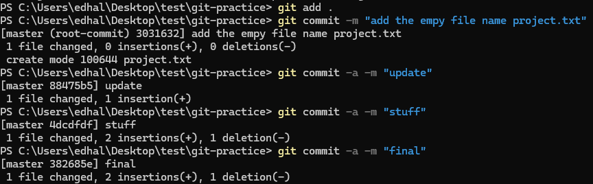
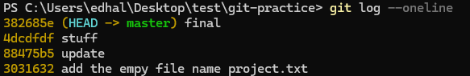
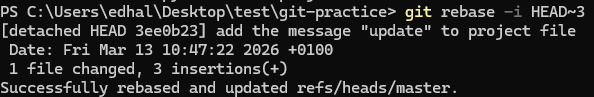
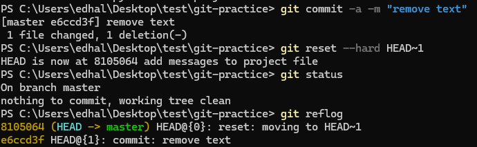
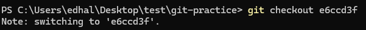
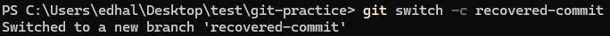
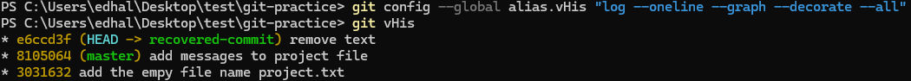
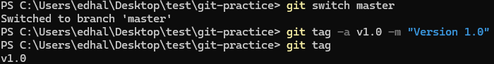
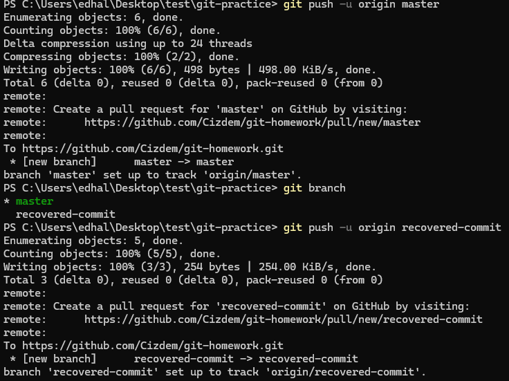

# git-homework

In this file below you can find screenshots from my terminal on how I finished the assignment.

1. Initialize a repo:
  

2. Add a file and make commits:
  
  

3.Clean up the commit history:
  

4-5. Simulate a mistake by commiting and going back, recover the lost commit:
  

6. Create a new branch with recovered commit:
  
  

7. Define a custom Git alias:
  

8. Tag the cleaned up version:
  

9. Push repo to GitHub:
  
